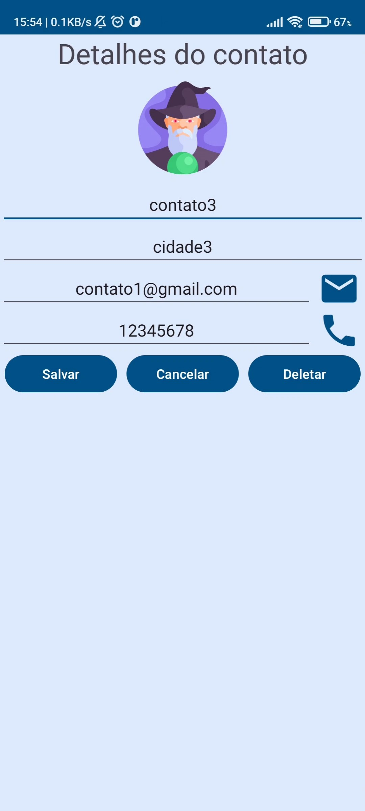
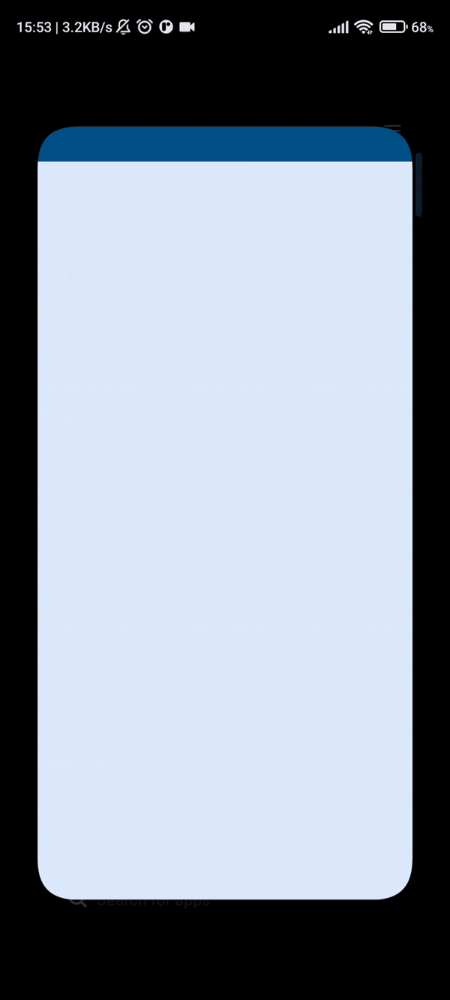
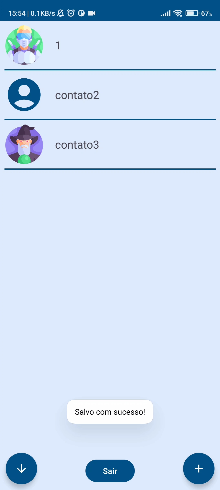
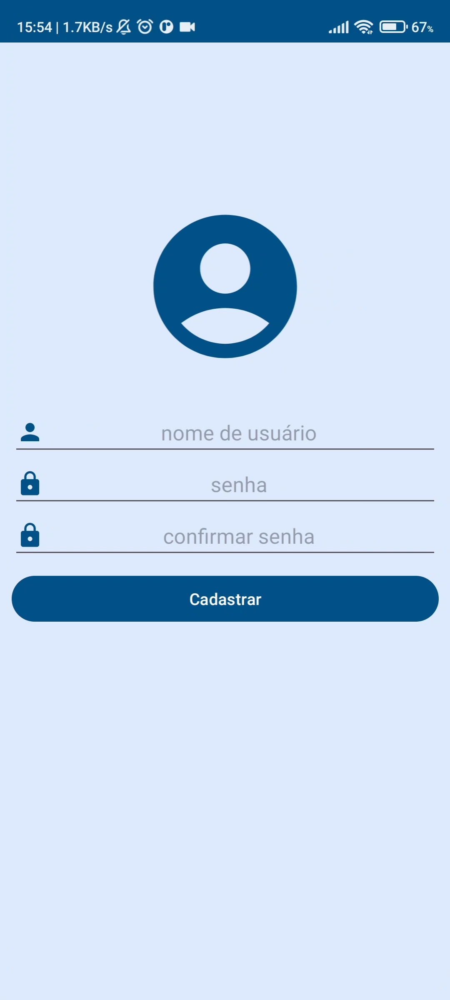
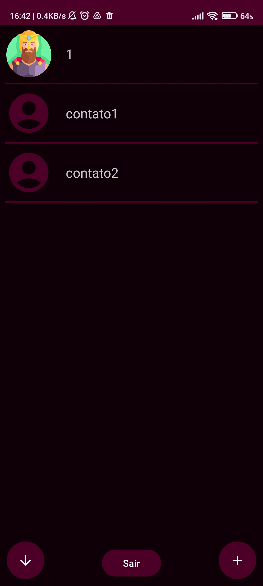
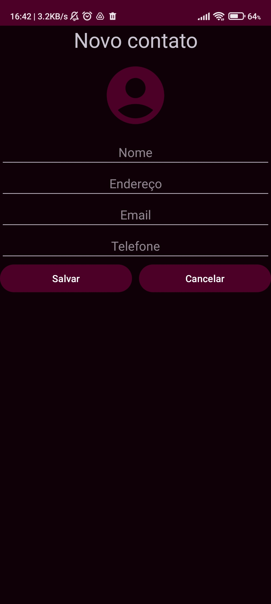

# 📞Lista de contatos
- O app possui modo escuro e modo claro
- O apk para download pode ser encontrado [clicando aqui](ContactListApp.apk)
- O app serve para organizar os contatos adicionando imagens aos contatos, nome. endereço, email e telefone.
- É ordenado alfabeticamente, permitindo inverter a ordem de ordenação 
- O app permite, com um simples clique no icone de telefone 📞 ao lado do número, fazer ligações para aquele contato
- O app permite também mandar email para o contato selecionado com um clique no icone ✉️ ao lado do campo de email
- O app possui CRUD completo de usuarios e contatos em SQLite
- O app usa shared preferences para guardar o login do usuario, mantendo-o logado, caso deseje
- O usuario é notificado durante a execução usando Toast

## Imagens do aplicativo funcionando no celular

  
    
    
